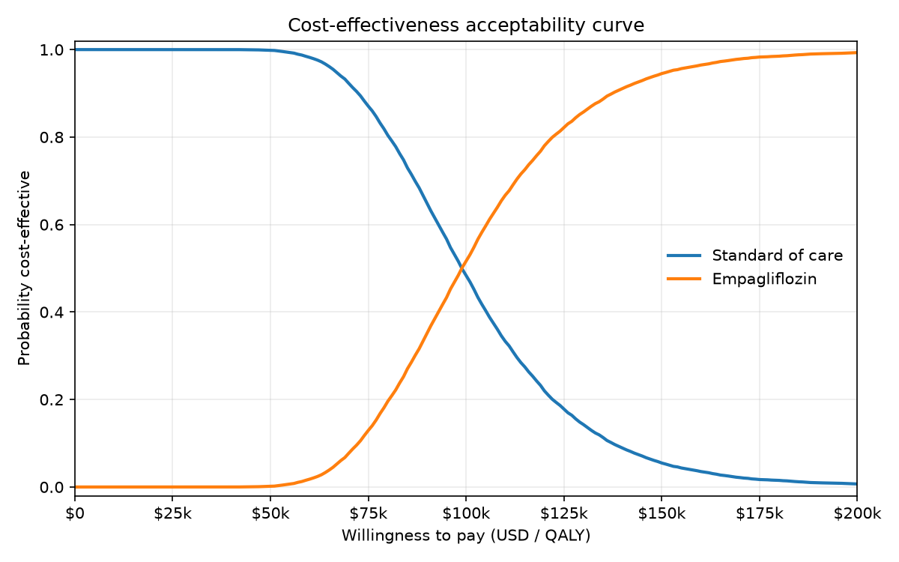

# OpenCEA

[](https://github.com/SHLEW06/opencea/actions/workflows/ci.yml)

> Open, reproducible, Python-native health-economic decision modeling — validated against a peer-reviewed reference and used to answer a real decision question.



## What it does

- **Validated against the peer-reviewed DARTH Sick-Sicker reference model** — the deterministic engine reproduces the published manuscript's total discounted costs and QALYs **to the cent** (Table 5) and the published ICERs **to the dollar** (Table 6) for all four strategies.
- **Vectorized PSA** with seeded reproducible sampling and CEAC, cost-effectiveness plane, and frontier output; **one-way DSA** with a clean tornado on incremental NMB.
- **Applied case study** — empagliflozin vs standard of care for T2D + established CVD, anchored on EMPA-REG OUTCOME (Zinman 2015), with deterministic CEA, scenario analysis (net price, treatment-effect waning), and breakeven pricing.

## Why it exists

Cohort state-transition cost-effectiveness modeling in 2026 is dominated by R-only stacks (heemod, hesim, dampack) and proprietary tools (TreeAge). Python — the language most data and ML teams already use — has been under-served. OpenCEA closes that gap with a transparent, vectorized, end-to-end pipeline whose every result is reproducible from a YAML parameter file and pinned to a published reference.

## Applied result — empagliflozin in T2D + CVD

> **Decision question:** Is empagliflozin added to standard of care cost-effective vs SoC alone for adults with T2D and established CVD at a willingness-to-pay of $100,000 / QALY, and how robust is that conclusion?

**Headline finding:** the cost-effectiveness of empagliflozin hinges on **the durability of the EMPA-REG all-cause mortality benefit, not on the drug price**. A typical net price (≈$4,500/yr) makes it decisively cost-effective if the trial effect persists, but no plausible rebate rescues cost-effectiveness if the effect wanes within ~10 years.

| Scenario | ICER ($/QALY) | P(cost-effective at $100k) |
|---|---:|---:|
| Base case (WAC $6,264/yr, sustained effect) | **98,900** | **0.517** |
| Net price (~$4,500/yr, sustained effect) | **77,564** | **0.920** |
| Waning effect (WAC) | 206,778 | 0.005 |
| Waning + net price | 154,665 | 0.001 |

Breakeven empagliflozin price for ICER = $100k/QALY: **$6,355/yr** under sustained effect (~1% rebate off WAC), **$2,650/yr** under waning (~58% rebate). Full CHEERS-structured writeup, parameter table with citations, and limitations: [`examples/empagliflozin_case_study.md`](examples/empagliflozin_case_study.md).

> *Disclaimer.* The case study is **illustrative**. All parameters come from publicly cited sources (EMPA-REG OUTCOME, ADA cost reports, UKPDS 62, Janssen 2022, Nicholson 2016, Red Book / JAHA 2024); none are invented. The model aggregates MI/stroke/HF into a single post-event state and uses WAC drug pricing as the base case (real US net prices are confidential).

## Quickstart

```bash
pip install opencea                     # once published; for development: pip install -e ".[dev]"
pytest                                  # 117 tests, < 5 s on a laptop
```

Validated reference model (DARTH Sick-Sicker):

```python
from opencea import build_darth_sick_sicker, run_model, run_psa, run_dsa
from opencea.cea import cea_table
from opencea.plots import plot_ceac, plot_tornado
from opencea.psa import default_wtp_grid

model = build_darth_sick_sicker("examples/sick_sicker.yaml")
print(cea_table(run_model(model), wtp=100_000))  # reproduces manuscript Table 6

psa = run_psa("examples/sick_sicker.yaml", n_sim=10_000, seed=20260625)
plot_ceac(psa, "ceac.png", wtp_grid=default_wtp_grid())

dsa = run_dsa("examples/sick_sicker.yaml", wtp=100_000)
plot_tornado(dsa, "tornado.png")
```

Empagliflozin case study:

```python
from opencea import (
    evaluate_empagliflozin_case, scenario_icer, breakeven_drug_price, WaningSpec,
)

YAML = "examples/empagliflozin_t2d.yaml"
print(scenario_icer(YAML))                                  # 98,900 base case
print(scenario_icer(YAML, drug_price=4500))                 # 77,564 net price
print(scenario_icer(YAML, waning=WaningSpec(3, 10)))        # 206,778 waning
print(breakeven_drug_price(YAML, target_icer=100_000))      # 6,355 / yr
```

## Features

- **`opencea.engine`** — cohort trace, discounting, within-cycle correction (Simpson's 1/3, half-cycle, or none). Optional time-varying transition sequence for scenarios like treatment-effect waning.
- **`opencea.model`** — Pydantic specification with strict validation (square row-stochastic transition matrices, probabilities/utilities in [0, 1], non-negative costs, dimension consistency).
- **`opencea.cea`** — total / incremental cost and QALY, ICER, NMB, strict dominance.
- **`opencea.psa`** — distribution spec, seeded sampler, vectorized Monte Carlo runner, CEAC, expected-NMB frontier.
- **`opencea.sensitivity`** — one-way DSA on incremental NMB at a chosen WTP, parameter ranges drawn from the PSA marginals, sorted-by-swing tornado output.
- **`opencea.plots`** — headless matplotlib: CE plane, CEAC, frontier, tornado.
- **`opencea.empagliflozin`** — applied 3-state, 2-strategy case study with scenario engine and breakeven solver.

## Validation & tests

**117 tests, 95% line coverage** (`pytest --cov=opencea`) run on every push to `main` and on every pull request across Python 3.10, 3.11, and 3.12 (see the [CI badge](https://github.com/SHLEW06/opencea/actions/workflows/ci.yml) at the top):

- **Deterministic golden tests** pinned to the published DARTH Sick-Sicker manuscript: Table 5 totals (SoC $151,580 / 20.711, A $284,805 / 21.499, B $259,100 / 22.184, AB $378,875 / 23.137) to the cent, Table 6 ICERs (B vs SoC $72,988/QALY, AB vs B $125,764/QALY) to the dollar.
- **PSA structural tests** — sampler reproducibility, per-parameter Monte Carlo mean recovery, PSA-mean vs deterministic Table 5 within ~1-2%, CEAC sanity at WTP extremes.
- **DSA structural tests** — base-case consistency with the validated engine, bracketing, swing ordering.
- **Empagliflozin case-study tests** — structural integrity, evaluator-vs-engine consistency, ICER sanity band, scenario directional checks (net-price lowers ICER; waning raises ICER), breakeven recovers the target ICER, time-varying engine sequence reduces to the validated time-homogeneous path when given identical matrices.

## Methodology & limitations

- **Cohort, not microsimulation.** No individual heterogeneity; appropriate when patient-level second-event interactions are not the focus.
- **Time-homogeneous baseline transitions.** Per-cycle transition matrices may vary on the empagliflozin (treatment) arm via the additive `simulate_trace_sequence` helper used for waning; the baseline path stays time-homogeneous.
- **Discounting** follows the DARTH convention `1 / (1 + d * cycle_length) ^ t`; within-cycle correction defaults to Simpson's 1/3 to match the reference.
- **Case study is illustrative.** See the disclaimer above and the limitations section of the writeup for full caveats (aggregated CV event state, WAC pricing, lifetime extrapolation of trial HRs, no adverse-event modeling).

## Architecture

```
src/opencea/
  model.py          # CohortModel + Strategy specs, YAML loading, validators
  engine.py         # simulate_trace, discount weights, gen_wcc, evaluate_strategy
                    # + simulate_trace_sequence / evaluate_sequence (additive)
  cea.py            # cea_table, icer, nmb, strict dominance
  builders.py       # build_darth_sick_sicker (validated reference)
  psa.py            # DistSpec, sample_psa_params, run_psa, compute_ceac,
                    # expected_nmb_frontier, incremental_vs_baseline
  sensitivity.py    # run_dsa, ParameterSweep, DSAResult, range derivation
  plots.py          # plot_ce_plane / plot_ceac / plot_ce_frontier / plot_tornado
  empagliflozin.py  # case study + scenario engine + breakeven solver

examples/
  sick_sicker.yaml                  # DARTH reference parameters
  empagliflozin_t2d.yaml            # case-study parameters (all cited)
  empagliflozin_case_study.md       # CHEERS-structured writeup
  figures/                          # rendered CEAC, tornado, CE plane, frontier

tests/
  test_darth_reference.py           # manuscript-pinned golden tests
  test_psa.py                       # PSA + CEAC structural tests
  test_sensitivity.py               # DSA tornado + bracketing tests
  test_empagliflozin_case.py        # case study + scenarios
```

For build history (what was added when), see [CHANGELOG.md](CHANGELOG.md).

## Roadmap

OpenCEA 0.1.0 covers the deterministic engine, PSA/CEAC, DSA/tornado, and one
applied case study. The following are **not yet implemented** and are stated
here so the scope of the current release is unambiguous:

- **FastAPI backend** — a thin HTTP layer over `run_model` / `run_psa` /
  `run_dsa` so a model spec can be posted and results streamed back as JSON.
- **Web front end** — a Streamlit or Next.js interface for interactive
  scenario exploration on the case study, sharing a URL to a specific
  parameter configuration.
- **LLM "assumption critic"** — an audit pass that reads a YAML parameter
  file plus its citations and flags implausible / uncited / conflicting
  assumptions before the model is run.
- **Individual-level (microsimulation) engine** — the current engine is
  cohort-only; a per-individual trajectory engine would let second-event
  interactions and heterogeneous baseline risk enter the analysis.
- **[opencea-evals](https://github.com/SHLEW06/opencea-evals)** — a
  companion repository (planned) of published cost-effectiveness models
  reproduced end-to-end in OpenCEA, each pinned to its manuscript totals
  and ICERs, as a growing external validation suite beyond DARTH
  Sick-Sicker.

## Reference

> Alarid-Escudero F, Krijkamp EM, Enns EA, Yang A, Hunink MGM, Pechlivanoglou P, Jalal H.
> *An Introductory Tutorial on Cohort State-Transition Models in R Using a Cost-Effectiveness Analysis Example.*
> Medical Decision Making, 2023; 43(1):3–20.
> Code: <https://github.com/DARTH-git/cohort-modeling-tutorial-intro>.

## License

MIT. Copyright (c) 2026 Shunji Lewandowski. See [LICENSE](LICENSE).
