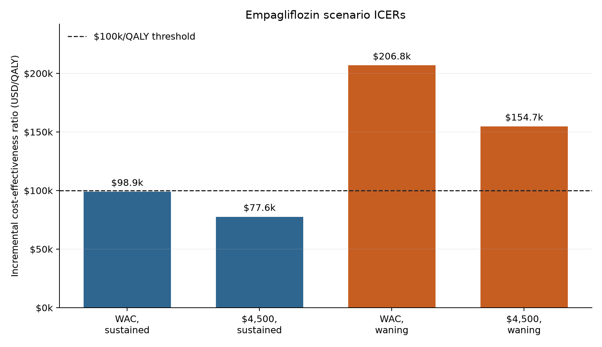
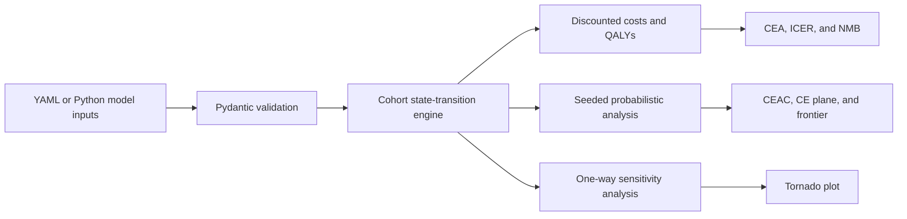
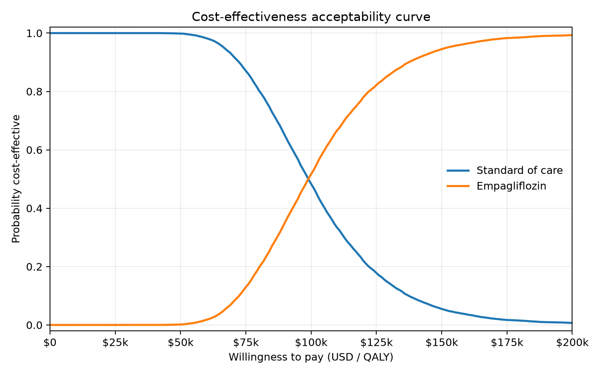
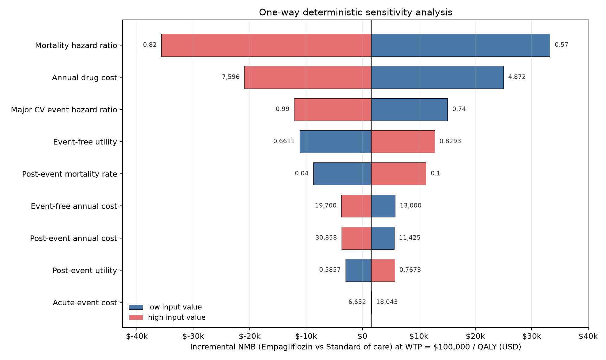

# OpenCEA

[](https://github.com/SHLEW06/OpenCEA/actions/workflows/ci.yml)

OpenCEA is a typed Python library for cohort state-transition
cost-effectiveness analysis. It takes validated model inputs through
discounted costs and QALYs, ICERs, probabilistic sensitivity analysis, and
publication-ready decision figures.

[Case study](examples/empagliflozin_case_study.md) |
[Release checklist](docs/RELEASE_CHECKLIST.md) |
[Changelog](CHANGELOG.md) |
[Contributing](CONTRIBUTING.md)

## At a glance

| Validation | Applied example | Uncertainty analysis | Supported Python |
|---|---|---|---|
| 125 tests, 95.86% coverage | Four empagliflozin scenarios | 10,000 seeded PSA draws | 3.10, 3.11, and 3.12 |

The included case study shows how price and treatment-effect duration change
the cost-effectiveness result at a $100,000-per-QALY threshold.



*In this illustrative model, the conclusion changes more under the waning-effect
assumption than under the modeled price reduction.*

## What it solves

A health-economic model needs more than a final ICER. A reviewer should be able
to trace assumptions into state transitions, see where uncertainty enters, and
reproduce the reference results. OpenCEA keeps that work in one Python
workflow.

| Contribution | Evidence in this repository |
|---|---|
| Validated cohort engine | Golden tests reproduce the DARTH Sick-Sicker reference model's discounted costs and QALYs to the cent and its reported ICERs to the dollar. |
| Decision analysis | The library covers deterministic CEA, seeded PSA, CEACs, one-way DSA, tornado plots, expected-NMB frontiers, and scenario analysis. |
| Release integrity | CI tests Python 3.10, 3.11, and 3.12, enforces a 90% coverage floor, checks types and formatting, tests the unpacked source distribution, and installs the wheel in a clean environment. |
| Applied example | The empagliflozin case study documents a source or modeling rationale for each input and reports how price and treatment-effect waning change the result. |

## Case study result

The included case study asks whether empagliflozin plus standard care is
cost-effective for adults with type 2 diabetes and established cardiovascular
disease at a willingness-to-pay threshold of $100,000 per QALY.

| Scenario | ICER ($/QALY) | Probability cost-effective at $100k |
|---|---:|---:|
| WAC price ($6,264/year), sustained effect | 98,900 | 0.517 |
| Net price ($4,500/year), sustained effect | 77,564 | 0.920 |
| WAC price, effect wanes from year 3 to year 10 | 206,778 | 0.005 |
| Net price, effect wanes from year 3 to year 10 | 154,665 | 0.001 |

In this illustrative three-state model, treatment-effect duration changes the
conclusion more than the modeled price reduction from $6,264 to $4,500. The
annual break-even price at $100,000 per QALY is $6,355 with a sustained effect
and $2,650 with waning.

The probability estimates use 10,000 seeded PSA draws. Run
`python scripts/generate_readme_assets.py` to reproduce the table inputs and
figures. The [case-study writeup](examples/empagliflozin_case_study.md) contains
the parameter sources, methods, and full limitations.

> The case study is an illustrative modeling exercise, not clinical or
> reimbursement guidance. It combines myocardial infarction, stroke, and heart
> failure in one post-event state, uses wholesale acquisition cost in the base
> case, and extrapolates trial hazard ratios beyond the trial period.

## Install from source

OpenCEA 0.1.1 is a validated release candidate and is not published on PyPI.
Install it from this repository with a supported Python version:

```bash
git clone https://github.com/SHLEW06/OpenCEA.git
cd OpenCEA
python3.12 -m venv .venv
source .venv/bin/activate
python -m pip install .
```

## Five-minute example

This example reproduces three values from the case-study summary:

```python
from pathlib import Path

from opencea import WaningSpec, breakeven_drug_price, scenario_icer

params = Path("examples/empagliflozin_t2d.yaml")
waning = WaningSpec(start_year=3, end_year=10)

print(f"Base-case ICER: ${scenario_icer(params):,.0f}/QALY")
print(f"Waning-effect ICER: ${scenario_icer(params, waning=waning):,.0f}/QALY")
price = breakeven_drug_price(params, target_icer=100_000)
print(f"Sustained-effect break-even price: ${price:,.0f}/year")
```

```text
Base-case ICER: $98,900/QALY
Waning-effect ICER: $206,778/QALY
Sustained-effect break-even price: $6,355/year
```

For an installed-package example that does not depend on repository files, run
`python examples/installed_smoke.py`.

## How the library fits together



The model and engine are independent of plotting. PSA and DSA return structured
results that can be tested or analyzed directly before any figure is rendered.

## Uncertainty and sensitivity

The CEAC shows how the preferred strategy changes across willingness-to-pay
thresholds. The tornado plot shows which input ranges move incremental net
monetary benefit the most at $100,000 per QALY.





Regenerate all README assets and their machine-readable result summary:

```bash
python -m pip install -e ".[dev]"
python scripts/generate_readme_assets.py
```

The command writes the figures and
[`empagliflozin-results.json`](docs/assets/empagliflozin-results.json) under
`docs/assets/`.

## Public API

| Module | Responsibility |
|---|---|
| `opencea.model` | Typed model and strategy specifications, YAML loading, and structural validation |
| `opencea.engine` | Cohort traces, discounting, within-cycle correction, and time-varying transition sequences |
| `opencea.cea` | Total and incremental outcomes, ICERs, NMB, and strict dominance |
| `opencea.psa` | Seeded parameter sampling, vectorized PSA, CEACs, and expected-NMB frontiers |
| `opencea.sensitivity` | One-way DSA and ordered parameter sweeps |
| `opencea.plots` | Headless CE plane, CEAC, frontier, and tornado rendering |
| `opencea.empagliflozin` | Applied case study, price scenarios, treatment-effect waning, and break-even analysis |

## Validation

The current suite has 125 tests and reports 95.86% line coverage. CI enforces a
90% minimum and runs:

- Ruff lint and formatting checks
- MyPy against the typed source package
- Pytest on Python 3.10, 3.11, and 3.12
- Source and wheel builds with metadata and archive checks
- The full test suite from the unpacked source distribution
- A clean wheel installation and public-API smoke calculation

The DARTH golden tests pin the reference totals for four strategies:

| Strategy | Discounted cost | Discounted QALYs |
|---|---:|---:|
| Standard care | $151,580 | 20.711 |
| Strategy A | $284,805 | 21.499 |
| Strategy B | $259,100 | 22.184 |
| Strategy AB | $378,875 | 23.137 |

The tested incremental ICERs are $72,988 per QALY for Strategy B versus
standard care and $125,764 per QALY for Strategy AB versus Strategy B. See
[`tests/test_darth_reference.py`](tests/test_darth_reference.py) for the
regression tolerances and source table mapping.

## Methodology and limitations

- OpenCEA currently models cohorts, not individual patient trajectories. It
  does not represent patient-level heterogeneity or repeated-event history.
- Baseline transitions are time homogeneous. The empagliflozin treatment arm
  can use a per-cycle transition sequence for waning scenarios.
- Discounting follows the DARTH reference convention. Simpson's one-third rule
  is the default within-cycle correction for the validated example.
- The applied model is intentionally compact. Its combined cardiovascular
  event state, wholesale acquisition cost, hazard-ratio extrapolation, and
  omitted adverse-event model limit how its outputs should be interpreted.

## Release and development

- [Release checklist](docs/RELEASE_CHECKLIST.md)
- [Publishing workflow](docs/PUBLISHING.md)
- [0.1.1 release notes](docs/release_notes_v0.1.1.md)
- [Development guide](CONTRIBUTING.md)
- [Citation metadata](CITATION.cff)

No PyPI package, hosted documentation site, or web application is claimed for
the current release candidate. Publishing, tagging, and release creation remain
manual maintainer actions.

## Roadmap

The current release covers the cohort engine, deterministic CEA, PSA and CEAC,
one-way DSA, plotting, and the applied case study. Possible later work includes
an HTTP API, an interactive scenario interface, individual-level simulation,
and additional external model reproductions in
[opencea-evals](https://github.com/SHLEW06/opencea-evals).

## Reference

OpenCEA's golden validation case follows:

> Alarid-Escudero F, Krijkamp EM, Enns EA, Yang A, Hunink MGM,
> Pechlivanoglou P, Jalal H. *An Introductory Tutorial on Cohort
> State-Transition Models in R Using a Cost-Effectiveness Analysis Example.*
> Medical Decision Making. 2023;43(1):3-20.
> [Reference code](https://github.com/DARTH-git/cohort-modeling-tutorial-intro)

## License

MIT. Copyright (c) 2026 Shunji Lewandowski. See [LICENSE](LICENSE).
